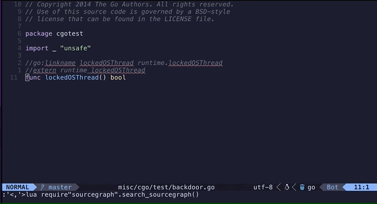

# Sourcegraph.lua

This repository contains a Lua plugin that integrates
[Sourcegraph](https://sourcegraph.com/) search into Neovim. This tool helps
developers search for code snippets directly from their Neovim environment.



## Features

- Open the URL in the default browser to show search results on Sourcegraph
- Contextual search based on the file type of the current buffer

## Usage

After you've installed the script (see Installation section below), you can use
it by simply selecting text in visual mode in Neovim and pressing `<leader>S`
(default - see below to change keybinding).
This will construct a Sourcegraph search URL with the selected text and open it
in your default web browser.

### Customizing the Key Binding

By default, the key binding to trigger a Sourcegraph search is `<leader>S`. If
you want to use a different key binding, you can set the `g:sourcegraph_key`
variable in your `.vimrc` or `init.vim` file. For example, to use `<leader>sg`
as the key binding, add this line:

```vim
let g:sourcegraph_key = '<leader>sg'
```

## Installation

Using vim-plug, add the following to your `init.vim` or `.vimrc`:

`Plug 'philiplinell/sourcegraph.lua'`

Save the file and run the `:PlugInstall` command in Neovim.

## Disclaimer

This is my first Neovim plugin, and I'm still learning the Neovim API, Lua, and
Sourcegraph. I've had a lot of help from ChatGPT, OpenAI's language model, both
for writing the sourcegraph.lua script and for creating this README.

I've listed some of the prompts I used with ChatGPT below, to give an idea of
how it helped create this plugin:

```
I would like to create a neovim plugin, in lua, that takes the text I have selected in visual mode and open that in a browser.

The text selected should be used instead of QUERY in the following string:

https://sourcegraph.com/search?q=context:global+QUERY&patternType=standard&sm=1
```

```
I'll create a repository that has the sourcegraph.lua file. Can you suggest a readme for the repository?
```

If you have any suggestions or improvements, or if you find any issues, please
don't hesitate to open an issue or a pull request. Any contributions are very
welcome!
